# MessEase

MessEase is a comprehensive platform designed to streamline mess and hostel management for educational institutions. Our solution simplifies administrative tasks, enhances communication between students and staff, and provides tools for efficient resource management.

**Live:** [mess-ease.vercel.app](https://mess-ease.vercel.app) | **Backend:** [messease-zwik.onrender.com](https://messease-zwik.onrender.com)

---

## Features

### 1. Core Management

- **Intuitive Interface:** Easy-to-use dashboard for managing tasks and schedules.
- **Automated Scheduling:** Seamlessly schedule shifts and mess operations.
- **Real-Time Monitoring:** Keep an eye on operations as they happen.
- **Detailed Reporting:** Generate insightful reports to track performance.
- **Customizable Settings:** Adapt the system to meet your specific mess management needs.
- **Secure & Scalable:** Built with security and future growth in mind.

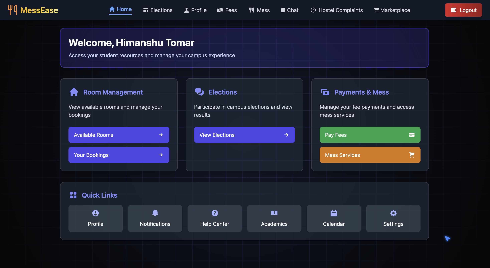

### 2. Complaint Management

- Submit and track complaints related to mess and hostel facilities
- Admin dashboard for reviewing and resolving complaints
- Status updates for submitted complaints
- Analytics to identify recurring issues

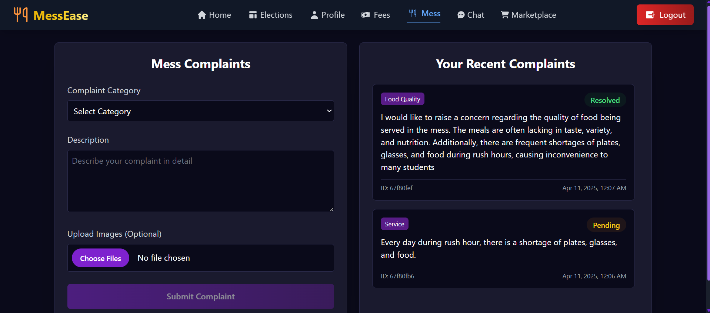
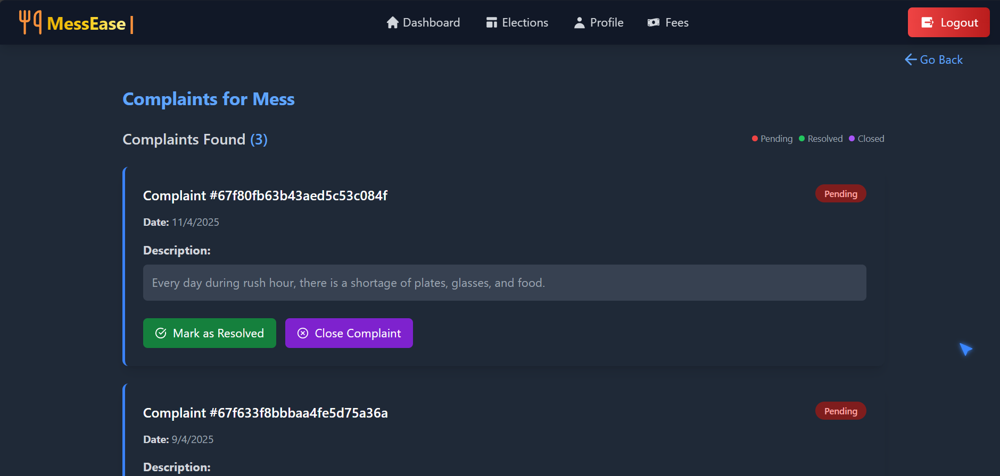

### 3. Marketplace for Students

A platform for students to buy, sell, or exchange study materials and academic resources.

- Post listings for books, gadgets, or study aids
- Search and filter listings by category, price, or condition
- Chat directly with sellers
- Secure payment integration
- Wishlist page to save items for future consideration
- My Listings page to manage your posted items

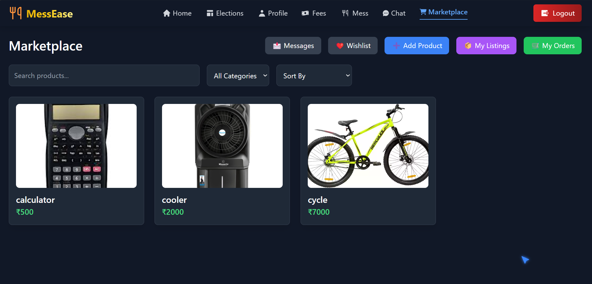
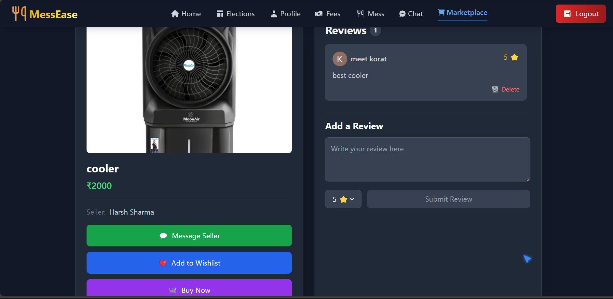

### 4. Election for Manager Post

A platform where the warden of the hostel can raise an election form where interested candidates can apply for a given post.

- Digital election system for mess and hostel manager positions
- Candidate registration and profile creation
- Secure voting mechanism
- Real-time results and analytics

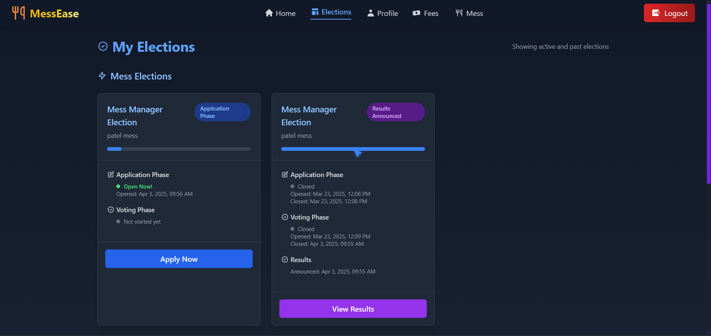

### 5. Fees Management

- Admin interface for raising hostel fee requests
- Student notification system for pending payments
- Secure payment gateway integration
- Payment history and receipt generation

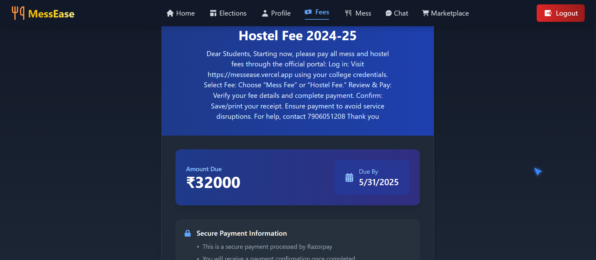
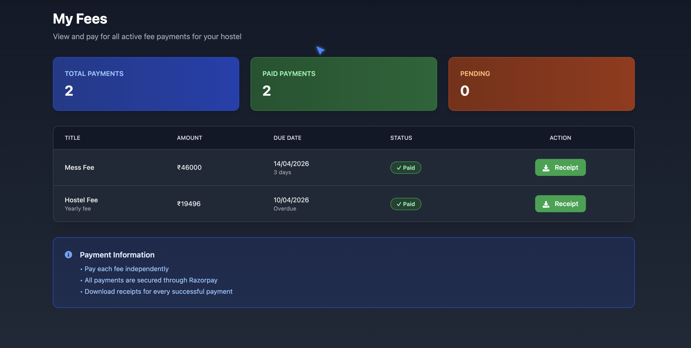

### 6. Guest Room Allocation

- Online booking system for guest rooms
- Availability calendar with real-time updates
- Approval workflow for guest stay requests
- Check-in/check-out management

---

## DevOps & Deployment

### CI/CD Pipeline

Every push to the `main` branch automatically triggers GitHub Actions. It runs tests on both frontend and backend, builds and pushes Docker images to Docker Hub, then deploys the backend to Render and the frontend to Vercel in parallel.


### Docker — Containerization

The app is fully containerized using Docker. The backend runs on `node:20-alpine` and the frontend is built with Vite and served via `nginx:alpine`. Both images are pushed to Docker Hub.

### Kubernetes — Container Orchestration

Kubernetes manifests are defined in the `k8s/` folder and tested locally with minikube. Each service runs with 2 replicas behind a LoadBalancer service.


### Terraform — Infrastructure as Code

Infrastructure is provisioned using Terraform with the Docker provider. Running `terraform apply` pulls the backend image from Docker Hub and spins up the container. State is tracked in `terraform.tfstate`.



### Tech Stack

| Layer | Technology |
|---|---|
| Frontend | React, Vite, Tailwind CSS, Redux |
| Backend | Node.js, Express, Socket.io |
| Database | MongoDB |
| Auth | Google OAuth |
| Payments | Razorpay |
| Containerization | Docker, Docker Compose |
| Orchestration | Kubernetes (minikube) |
| IaC | Terraform |
| CI/CD | GitHub Actions |
| Deployment | Render (backend), Vercel (frontend) |
| Monitoring | Prometheus, Grafana |

---

## Installation

1. **Clone the repository:**
```bash
    git clone https://github.com/himanshutomar114/MessEase.git
    cd MessEase
```

2. **Install dependencies:**
```bash
    npm install
```
    or
```bash
    yarn install
```

3. **Run the project locally:**
```bash
    npm run dev
```

### Run with Docker
```bash
docker-compose up --build
# Frontend: http://localhost:5173
# Backend:  http://localhost:5000
```

---

## Frontend

### Steps

1. **Install dependencies:**
```bash
   npm install
```

2. **Run the development server:**
```bash
   npm run dev
```

3. **Add a `.env` file** with the following environment variables:
VITE_GOOGLE_CLIENT_ID=
VITE_SERVER_URL=

---

## Backend

### Steps

1. **Add a `.env` file** with the following environment variables:
```env
   PORT=4001
   MONGODB_URI=
   CLOUDINARY_CLOUD_NAME=
   CLOUDINARY_API_KEY=
   CLOUDINARY_API_SECRET=

   ACCESS_TOKEN_SECRET=
   ACCESS_TOKEN_EXPIRY=
   REFRESH_TOKEN_SECRET=
   REFRESH_TOKEN_EXPIRY=

   GOOGLE_CLIENT_ID=
   NODE_ENV=

   EMAIL_USER=
   EMAIL_PASS=

   SENDINBLUE_API_KEY=

   RAZORPAY_API_KEY=
   RAZORPAY_API_SECRET=

   CLIENT_URL=
```

2. **Install dependencies:**
```bash
   npm install
```

3. **Run the project locally:**
```bash
   npm run dev
```

---

## Developers

**MessEase** is developed and maintained by:

- **Himanshu Tomar**
  - Full Stack Developer
  - Email: [himanshutomar114@gmail.com](mailto:himanshutomar114@gmail.com)
  - GitHub: [@himanshutomar114](https://github.com/himanshutomar114)
  - Role: Project Lead & Core Developer
  - Contributions: System architecture, backend development, frontend development, database design, DevOps & deployment

---

## License

MessEase is licensed under the MIT License. See the [LICENSE](LICENSE) file for details.

## Contact

For questions, suggestions, or contributions, please contact [himanshutomar114@gmail.com](mailto:himanshutomar114@gmail.com).